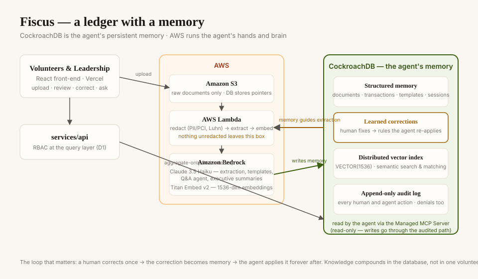

# Fiscus — a ledger with a memory

**Agentic bookkeeping for volunteer-run nonprofits.** Volunteers photograph receipts; an agent reads them, files them, and learns from every correction. Leadership sees where money goes without ever touching raw transactions. CockroachDB is the agent's persistent memory: templates, transactions, embeddings, corrections, sessions, and an append-only audit trail all live in one distributed database.

Built for the **CockroachDB × AWS Hackathon — "Build with Agentic Memory"** (Aug 2026).

## Links

- **Live demo:** https://fiscus-blue.vercel.app
- **Demo video (<3 min):** https://youtu.be/4vXefowUusE
- **Team:** Ethan Hu, Eric Lin, Aaron Liu, Bryan Wei

## Why memory is the product

A shoebox of receipts is only painful because the knowledge of how to file them lives in one volunteer's head. Fiscus moves that knowledge into the database:

- Every reviewer **correction** is stored and generalized — the agent applies it to the next similar document (`corrections` table, "learned rules").
- **Templates** the agent proposes from example forms are stored with embeddings and reused after human approval.
- **Session state** persists — a volunteer resumes reviewing exactly where they left off.
- Every action, human or agent, lands in an **append-only audit log**.

The agent gets more useful the longer the org uses it. That compounding is the memory story.

## Quickstart

### Front-end (no credentials needed)

```bash
cd services/web
npm install
npm run dev        # http://localhost:5173
```

Runs fully on an in-memory mock of the API contract — see `services/web/README.md` for a tester tour (upload → review → correct → approve → dashboard, plus the demo role switcher).

### Backend

```bash
npm install                # root deps: pg, tsx, aws-sdk, etc.
cp .env.example .env       # fill in COCKROACH_DATABASE_URL (+ AWS_REGION for live Bedrock)
npm run db:migrate         # applies db/migrations/*.sql in order, tracked in schema_migrations
npm run db:seed            # deterministic fixture data (3 orgs, volunteers, templates, transactions, corrections)
```

Verify: `SHOW CREATE TABLE templates;` / `SHOW CREATE TABLE transactions;`
should print `VECTOR INDEX ... (org_id, embedding vector_l2_ops)` explicitly
in the reconstructed DDL. Full schema + migration tool rationale:
[docs/schema.md](docs/schema.md).

Without `COCKROACH_DATABASE_URL` set, individual services fall back to
their own local mock-db.json fixtures (see each `services/*/README.md`) —
`db:migrate` / `db:seed` specifically need a real cluster since they write
to the shared dev database, not a mock.

### Template generation (issue B2)

```bash
cd services/ingestion/template-gen
npm install
npm run template:generate -- --form-type vet_invoice --files fixtures/vet_invoice_1.txt fixtures/vet_invoice_2.txt
npm run template:approve -- --id <template_id>
```

Works with zero credentials in mock mode; set `DATABASE_URL` + AWS creds for live CockroachDB + Bedrock. PII/PCI is redacted before any text reaches Bedrock.

## Architecture



```
Volunteer ──► Front-end (Vercel) ──► services/api ──► CockroachDB (memory layer)
                                          │                ├─ vector index (embeddings, 1536-dim Titan)
Raw doc ──► S3 ──► Lambda ────────────────┘                ├─ structured tables (templates, transactions, corrections, sessions)
            (redact → Bedrock extract → embed → write)     └─ append-only audit_log

Agent (Bedrock) ◄──► CockroachDB Managed MCP Server (read-only) ◄──► CockroachDB
```

Full data model and team conventions: [AGENTS.md](AGENTS.md).

## CockroachDB tools used, and what the agent actually did with them

| Tool | How Fiscus uses it |
|---|---|
| **Distributed Vector Indexing** | Templates and transactions store 1536-dim Titan embeddings in `VECTOR` columns. The semantic search bar ("find that vet invoice from June") and template-matching at extraction time query the vector index — the agent's long-term memory retrieval. |
| **Managed MCP Server** | The volunteer-facing agent answers questions ("how much did we spend on vet care?") by reading CockroachDB through the managed MCP endpoint, read-only by default, so the agent can query memory but never bypass the audited write path. |

_[If ccloud CLI or Agent Skills were used by submission time, add rows honestly; otherwise leave as the two above — the rules require at least two.]_

## AWS services used

| Service | How |
|---|---|
| **Amazon S3** | Raw document storage. Only extracted, redacted fields reach the database; the DB stores S3 pointers. |
| **AWS Lambda** | Extraction pipeline: pulls the uploaded doc, redacts PII/PCI (card numbers never leave the function unredacted), calls Bedrock, writes fields + embedding + audit row. |
| **Amazon Bedrock** | Twice: field extraction and template inference (Claude), and embeddings (Titan). Also powers the conversational agent. |

## Security posture

Redaction at ingestion (before Bedrock, before persistence) · RBAC enforced at the query layer, leadership sees aggregates only · every write audited via a shared helper · raw docs auto-expire per org retention policy (schema-level; see AGENTS.md §5).

## Repository map

```
services/web         React front-end (volunteer flow, leadership dashboard, agent chat)
services/api         API layer
services/ingestion   Upload/extraction pipeline + template generation (B2)
services/agent       Bedrock agent
lib/                 Shared helpers (redaction, audit, embeddings)
db/migrations        CockroachDB schema
docs/tool-usage.md   Per-feature log of which required tools each piece exercises
```

## License

MIT — see [LICENSE](LICENSE).
